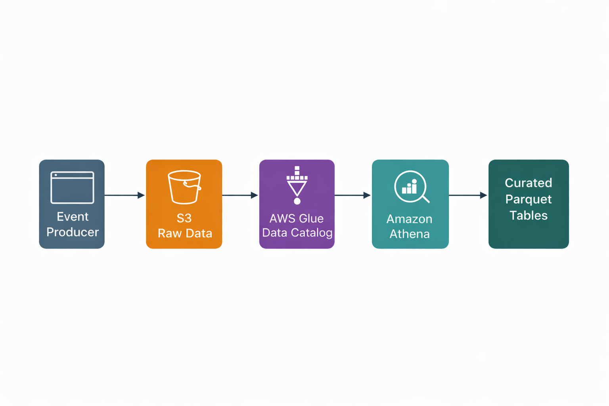

# 01 — Clickstream Analytics on AWS (S3 + Glue Catalog + Athena)

## What this project shows
A simple end-to-end analytics flow:
- raw clickstream events land in S3 (JSON lines)
- metadata is managed in AWS Glue Data Catalog
- Athena queries raw data and creates curated tables (Parquet + 
partitions)

This is a common “data lake” pattern: **storage in S3, metadata in Glue, 
SQL in Athena**.

---

## Architecture:


Event Producer
|
S3(raw JSONL)-> Glue Data Catalog(Schema + partitions)-> Athena(SQL)
|
Parquet curated tables


---

##Screenshots (Exact pictures from aws console):
1.s3 raw prefix(screenshots/s3_raw_prefix.jpeg)
2.Athens Tables and Query Results(screenshots/athens_query_results.jpeg)

## Data layout (S3)
Raw data is stored using time-based partitions:

s3://<your-bucket>/raw/clickstream/year=YYYY/month=MM/day=DD/hour=HH/*.jsonl


Why this structure:
- makes it easy to filter by time in queries
- avoids scanning unnecessary data in Athena
- matches common industry partitioning (time is almost always the first partition dimension)

---

## Glue Data Catalog (why it matters)
S3 only stores files. It does not store table definitions.

Glue Data Catalog stores:
- database name
- table name
- schema
- partition keys
- S3 location

Athena uses this catalog to run SQL without loading data into a database.

---

## What I validated
- Raw files exist in S3 under `raw/clickstream/`
- Athena database created successfully
- Athena external table created with partitions
- SQL queries return expected results

---

## Screenshots (proof)
Put screenshots in `screenshots/`:
- S3 raw prefix visible
- Athena table created
- Athena query results

---

## Example queries

### Count events per user
```sql
SELECT user_id, COUNT(*) AS events
FROM clickstream_events
GROUP BY user_id
ORDER BY events DESC;


##Counts events by day

SELECT year, month, day, COUNT(*) AS events
FROM clickstream_events
GROUP BY year, month, day
ORDER BY year, month, day;


## Services used:

-Amazon S3
-AWS Glue Data Catalog
-Amazon Athena
