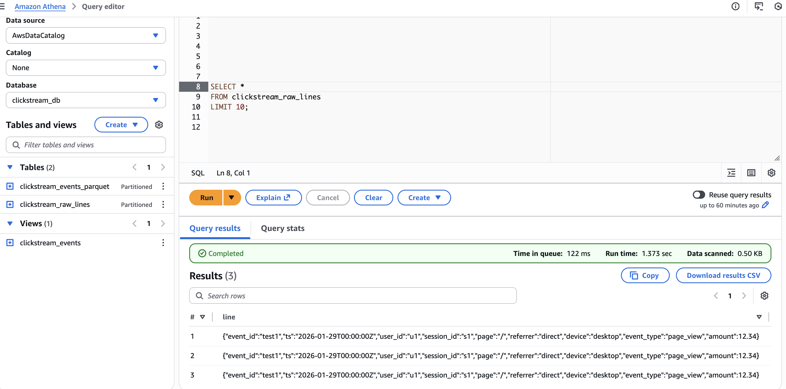
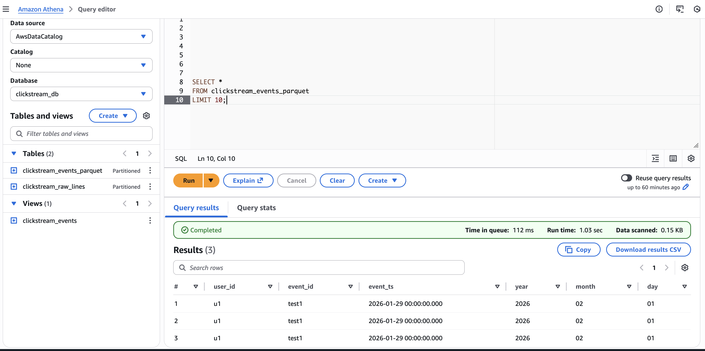
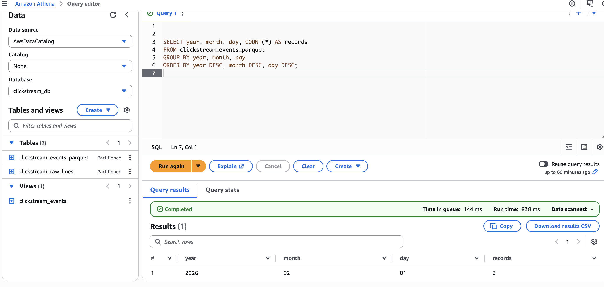
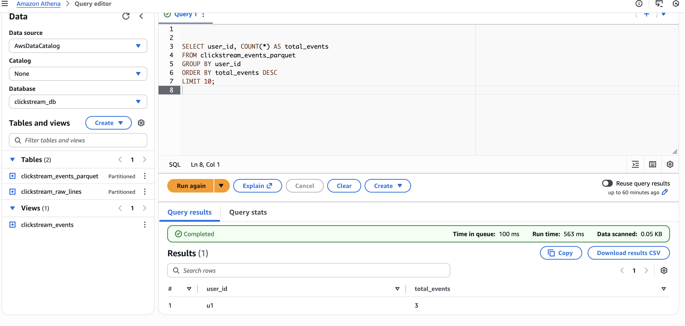

# 01 — Clickstream Analytics on AWS (S3 + Glue Catalog + Athena)

## What this project shows
A simple end-to-end analytics flow:
- Raw clickstream events land in Amazon S3 (JSON lines)
- Metadata (schema + partitions) is managed in AWS Glue Data Catalog
- Amazon Athena queries raw data and creates curated tables (Parquet + partitions)

This is a common “data lake” pattern: **storage in S3, metadata in Glue, 
SQL in Athena**.

---

## Architecture:

##Flow:
Event Producer → S3 (raw JSONL) → Glue Data Catalog (schema + partitions) → Athena (SQL) → S3 (curated Parquet)

---
## Screenshots (AWS Console proof)

### 1) S3 raw prefix

### 2) Athena tables and query results

### 3) Athena raw sample

### 4) Athena parquet sample

### 5) Athena partitions

### 6) Athena user analytics

---

## Data layout (S3)
Raw data is stored using time-based partitions:

s3://de-portfolio-clickstream-chandu-1221/raw/clickstream/year=YYYY/month=MM/day=DD/hour=HH/*.jsonl

---
## Services used:

-Amazon S3
-AWS Glue Data Catalog
-Amazon Athena

---

Why this structure:
- Makes it easy to filter by time in queries

- Avoids scanning unnecessary data in Athena (lower cost + faster)

- Matches common industry partitioning (time is almost always the first partition dimension)

---

## Glue Data Catalog (why it matters)
S3 only stores files. It does not store table definitions.

Glue Data Catalog stores:
- database name
- table name
- schema
- partition keys
- S3 location

Athena uses this catalog to run SQL without loading data into a database.

---
What I built (Athena / Glue Catalog)

clickstream_raw_lines
Raw JSONL table (external)

clickstream_events_parquet
Curated Parquet table (external, partitioned)

clickstream_events
View for easy querying (optional semantic layer)
----

What I validated

Raw files exist in S3 under raw/clickstream/

Athena database created successfully

Athena external table created with partitions

SQL queries return expected results
-----

## Example queries 
1) Count events per user (view)
SELECT user_id, COUNT(*) AS events
FROM clickstream_events
GROUP BY user_id
ORDER BY events DESC;

2) Count events by day (view)
SELECT year, month, day, COUNT(*) AS events
FROM clickstream_events
GROUP BY year, month, day
ORDER BY year, month, day;

3) Preview raw JSON lines
SELECT *
FROM clickstream_raw_lines
LIMIT 10;

4) Preview curated Parquet rows
SELECT *
FROM clickstream_events_parquet
LIMIT 10;

5) Count events by day (partition-friendly)
SELECT year, month, day, COUNT(*) AS records
FROM clickstream_events_parquet
GROUP BY year, month, day
ORDER BY year DESC, month DESC, day DESC;

6) Count events per user (parquet)
SELECT user_id, COUNT(*) AS total_events
FROM clickstream_events_parquet
GROUP BY user_id
ORDER BY total_events DESC
LIMIT 10;
